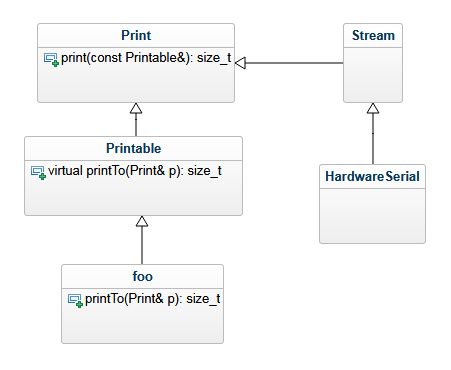
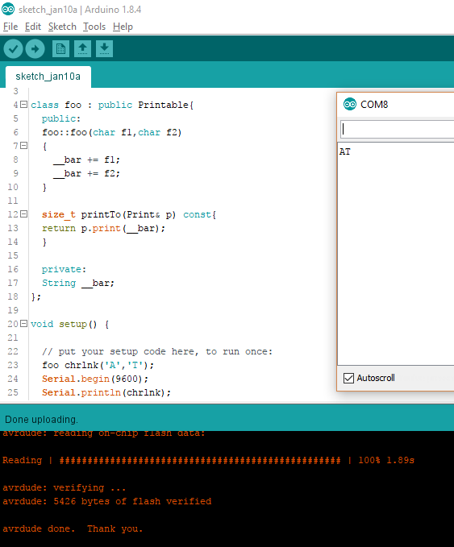

这篇文章来自于[https://atadiat.com/en/e-yield-function-printable-class-mapping-arrays-useful-arduino-core/](https://atadiat.com/en/e-yield-function-printable-class-mapping-arrays-useful-arduino-core/)，文章讲解了Arduino内核的一些特性，对于深入理解Arduino非常有帮助。

Arduino core 是Arduino API函数和类的源代码，有三个可以被有效使用的功能。由于Arduino内核文档中并没有提到它们（至少在发布此微博之前），所以arduino开发者并没有很好的知道这些功能。让我们逐一讨论他们中的每个功能。

## Printable Class：如何让任何对象可打印

首先，在诸如HardwareSerial类的Serial实例之类的对象中使用的print（）和println（）方法最初是从称为Print的类继承的（它不是直接继承，而是通过由HardwareSerial继承的Stream类）。 为了使这两种方法能够打印新类中的任何对象，主Print类继承了另一个名为Printable的类，该类仅包含一个名为printTo（）的公共方法。 此方法是虚拟的，因此每个新类都可以继承由开发人员定义的Printable，可以对方法进行自己的定义。 从GeeksforGeeks教程中回顾继承和虚拟函数的概念。

```c
class Printable
{
  public:
    virtual size_t printTo(Print& p) const = 0;
};
```

另一方面，Print类对于`print()`和`println()`方法有一个使用`printTo()`方法的特殊重载版本。

```c++
size_t Print::print(const Printable& x)
{
  return x.printTo(*this);
}
size_t Print::println(const Printable& x)
{
  size_t n = print(x);
  n += println();
  return n;
}
```



总而言之，下面的的演示使Printable的用法更加清晰。

```c++
class foo : public Printable{
  public:
  foo::foo(char f1,char f2)
  {
    __bar += f1;
    __bar += f2;
  }
  size_t printTo(Print& p) const{
  return p.print(__bar);
  }
  private:
  String __bar;
};
void setup() {
 
  // put your setup code here, to run once:
  foo chrlnk('A','T');
  Serial.begin(9600);
  Serial.println(chrlnk);
}
void loop() {
} 
```



知道`IPAddress.h`使用相同的技巧在`IPAddress.cpp`中打印IP地址也很有用。

## yield() 函数：该函数在Arduino延时函数运行的同时保持运行

当浏览Arduino的内核源文件时，我发现了一个名为hooks.c的怪异文件，里面只有很少的代码行。

```c++
static void __empty() {
    // Empty
}
void yield(void) __attribute__ ((weak, alias("__empty")));
```

阅读文件中包含的注释，似乎弱函数`yield()`打算用于[计划方面](https://www.arduino.cc/en/Reference/Scheduler)。弱是指可以在另一个源文件中重新定义它。但是，对于基于AVR的Arduino板，仅在一个地方使用此功能。在wring.c源文件中的delay（）函数内部。

```c++
void delay(unsigned long ms)
{
    uint32_t start = micros();
    while (ms > 0) {
        yield();
        while ( ms > 0 && (micros() - start) >= 1000) {
            ms--;
            start += 1000;
        }
    }
}
```

一种有用的用法是在主应用程序代码中重新定义`yield()`来处理一些敏感的操作，而Arduino除了等待延迟结束甚至实现一些简单的调度程序外，什么也不会做。

## 引脚映射：映射数组将Arduino引脚映射到物理连接引脚

Arduino团队通过在闪存（PROGMEM）中定义数组来永久存储arduino引脚号与端口寄存器中相应物理引脚号以及相应端口地址之间的映射，从而简化了访问MCU端口/ GPIO的方式。 这些数组可以在pins_arduino.h头文件中找到。

```c++
const uint16_t PROGMEM port_to_input_PGM[] = {
    NOT_A_PORT,
    NOT_A_PORT,
    (uint16_t) &PINB,
    (uint16_t) &PINC,
    (uint16_t) &PIND,
};
const uint8_t PROGMEM digital_pin_to_port_PGM[] = {
    PD, /* 0 */
    PD,
    PD,
    PD,
    PD,
    PD,
    PD,
    PD,
    PB, /* 8 */
    PB,
    PB,
    PB,
    PB,
    PB,
    PC, /* 14 */
    PC,
    PC,
    PC,
    PC,
    PC,
};
```

Arduino.h文件定义了一些宏，以通过pgm_read_word访问存储在闪存中的这些阵列。

```c++
#define digitalPinToPort(P) ( pgm_read_byte( digital_pin_to_port_PGM + (P) ) )
#define portInputRegister(P) ( (volatile uint8_t *)( pgm_read_word( port_to_input_PGM + (P))) )
```

现在，每个需要访问这些寄存器的功能都可以简单地调用映射宏。 即 pinMode，digitalWrite等。