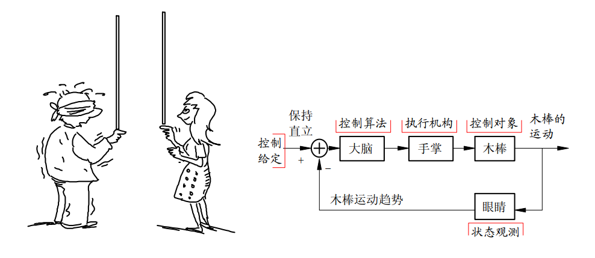
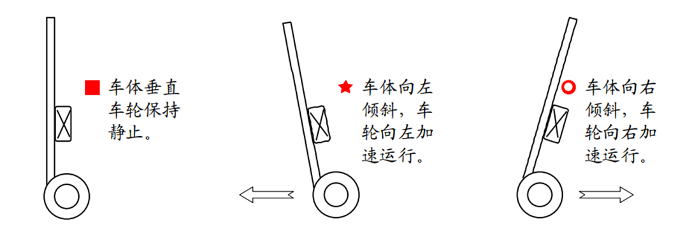

# 平衡车制作---原理篇

[TOC]

## 前言

本篇教程内容主要来自于《直立平衡车模参考设计方案》，且这里是从概念层面讲述的并没有具体的控制理论方面的内容。有了这些概念方面的知识制作一个初级版的平衡车已经足够了。

## 直立控制

### 直观感受

悄悄告诉你个秘密：其实你天生就已经知道了直立控制的原理。不信的话，你用手指撑个木棍就知道了，这其中已经包含了直立控制原理。根据控制理论的知识可以将其抽象为一个**负反馈系统**。

这样对于两轮车能够直立而言，我们有一个直观的感受：车模向前倾斜轮子向前加速，车模向后倾斜轮子向后加速，车模便可以完成直立。

这样的直观感受在我们后期的制作调试过程中是非常重要的。接下来稍微深入了了解下直立控制的原理。

### 内部机理

- 重力场中使用细线悬挂着重物经过简化便形成理想化的单摆模型
- 直立着的车模可以看成放置在可以左右移动平台上的倒立着的单摆（倒立摆）

单摆能够稳定在垂直位置需要两个条件：

1. 受到与位移（角度）相反的回复力；
2. 受到与运动速度（角速度）相反的阻尼力；

 

（非惯性系，以车轮作为坐标原点）分析倒立摆受力，它就会受到额外的惯性力，该力与车轮的加速度方向相反，大小成正比。(假设a和θ成正比比例系数为k1)(θ较小，为便于分析此处进行了线性化)
$$
F = mgsinθ - macosθ ≈ mgθ - mk1θ
$$
如果比例 k1>g,那么回复力的方向便于位移方向相反了 

类比于单摆平衡的条件，为了使得倒立摆能够尽快地在垂直位置稳定下来，还需要增加控制阻尼力（方向与偏角的速度成正比方向成反比）。 则
$$
𝐹=𝑚𝑔𝜃−𝑚k1𝜃−𝑚𝑘2𝜃’
$$
​                                                     

==只要保证在k1>g,k2>0的条件下，可以使得车模像单摆一样维持在直立状态。==其中两个控制参数：

- k1决定了车模是否能够稳定到垂直平衡位置，它必须大于重力加速度；

- k2决定了车模回到垂直位置的阻尼系数，选取合适的阻尼系数可以保证车模尽快稳定在垂直位置 

根据以上分析可以得到，控制车模直立的条件如下：

1. **能够精确测量车模倾角θ 的大小和角速度θ ' 的大小**；
2. **可以控制车轮的加速度**； 

通过惯性测量单元IMU可以测得车模倾角和角速度，通过改变施加在电机上的PWM值可以改变车轮的加速度，到此根据直立控制原理我们已经可以搭出可以直立的车模了，但该车模的抗干扰能力很弱：例如车模受到前进方向的轻微扰动，车模便会向前倾斜并一直向前加速直至最终倒下。为提高车模的抗干扰能力还需要添加速度控制。

## 速度控制

由于速度控制过程中需要始终保持车模的直立，平衡车的速度控制过程更加复杂，这里仅从直观感受上分析以下：假设车模开始保持静止，然后增加给定速度，为此需要车模往前倾斜以便获得加速度。在车模直立控制下，为了能够有一个往前的倾斜角度，车轮需要往后运动，这样会引起车轮速度下降（因为车轮往负方向运动了）。由于负反馈，使得车模往前倾角需要更大。如此循环，车模很快就会倾倒。原本利用负反馈进行速度控制反而成了**“正”反馈**。  

**速度控制实际是通过控制车模的倾角实现的**，若采用此种方式会涉及到PID级联的一些知识（后面单独分析，若想实现速度恒定或站立在倾斜的平面上需要采用此种方式）。根据《直立平衡车模参考设计方案》速度控制章节的分析我们知道：经过一系列的简化改进，**速度控制已经演变成的对电机的直接控制**，但需要注意直立控制是平衡控制的核心，速度控制要尽可能减少对直立控制的干扰因此速度控制要平滑滤波（减小控制参数或将速度控制量分配到多个直立控制周期输出）。

## 方向控制

方向控制实际是通过对电机的差分控制实现的，方向控制也要尽可能减少对直立控制的干扰。

## 总结

三个分解后的任务各自独立进行控制。由于最终都是对同一个控制对象（车模的电机）进行控制，所以它们之间存在着耦合。

这三个任务中保持车模平衡是关键。由于车模同时受到三种控制的影响，从车模平衡控制的角度来看，其它两个控制就成为它的干扰。因此对车模速度、方向的控制应该尽量保持平滑，以减少对于平衡控制的干扰。 

