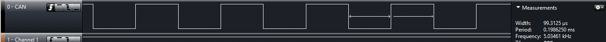
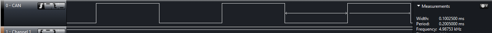

# STM32 HAL库微秒延时函数的实现

天下苦`STM32 HAL`库微秒延时久已。**不占用其他定时器资源**又**不使用循环的方式**就不能实现微秒延时函数了吗？答案是否定的，我们还有方式实现，且还不止一种方法。详情且看下文分解：

以下两种延时方式来源：`Arduino_Core_STM32`源码`delayMicroseconds(uint32_t us)`函数的实现。

## 利用SysTick再实现微秒延时函数

虽然`SysTick`已经被配置为1ms中断一次的模式，但每个1ms之间`SysTick`的当前值寄存器是一直在计数的（每计一个数的时间是`1/SytemCoreClock`）我们便可以利用该机制实现微秒延时函数。

```c
void delayMicroseconds(uint32_t us)
{
    __IO uint32_t currentTicks = SysTick->VAL;
  /* Number of ticks per millisecond */
  const uint32_t tickPerMs = SysTick->LOAD + 1;
  /* Number of ticks to count */
  const uint32_t nbTicks = ((us - ((us > 0) ? 1 : 0)) * tickPerMs) / 1000;
  /* Number of elapsed ticks */
  uint32_t elapsedTicks = 0;
  __IO uint32_t oldTicks = currentTicks;
  do {
    currentTicks = SysTick->VAL;
    elapsedTicks += (oldTicks < currentTicks) ? tickPerMs + oldTicks - currentTicks :
                    oldTicks - currentTicks;
    oldTicks = currentTicks;
  } while (nbTicks > elapsedTicks);
}
```

以上函数可以直接复制到工程中使用，不需要额外的任何配置。



---

**`Note`**

虽然函数参数`us`为`uint32_t`类型，但是延时数不能过大，原因自己分析。建议超过1ms的延时时间使用`HAL_Delay()`。

---

## 利用DWT（数据观测点）实现微秒延时函数

对于DWT大家可以搜索具体了解，这里我也不是很了解，就直说实现方法好了。

### `dwt.h`文件

```c
/**
  ******************************************************************************
  * @file    dwt.h
  * @author  Frederic Pillon
  * @brief   Header for dwt.c module
  ******************************************************************************
  * @attention
  *
  * Copyright (c) 2019, STMicroelectronics
  * All rights reserved.
  *
  * This software component is licensed by ST under BSD 3-Clause license,
  * the "License"; You may not use this file except in compliance with the
  * License. You may obtain a copy of the License at:
  *                        opensource.org/licenses/BSD-3-Clause
  *
  ******************************************************************************
  */

/* Define to prevent recursive inclusion -------------------------------------*/
#ifndef _DWT_H_
#define _DWT_H_

#include "stm32f4xx.h"
#include <stdbool.h>

#ifndef UNUSED
#define UNUSED(x) (void)x
#endif

#ifdef DWT_BASE
uint32_t dwt_init(void);

#ifdef __cplusplus
extern "C" {
#endif

//uint32_t dwt_init(void);
void dwt_access(bool ena);

static inline uint32_t dwt_max_sec(void)
{
  return (UINT32_MAX / SystemCoreClock);
};

static inline uint32_t dwt_max_msec(void)
{
  return (UINT32_MAX / (SystemCoreClock / 1000));
};

static inline uint32_t dwt_max_usec(void)
{
  return (UINT32_MAX / (SystemCoreClock / 1000000));
};

static inline uint32_t dwt_getCycles(void)
{
  return (DWT->CYCCNT);
};

#ifdef __cplusplus
}
#endif

#endif /* DWT_BASE */
#endif /* _DWT_H_ */

```


### `dwt.c`文件

```c
/**
  ******************************************************************************
  * @file    dwt.c
  * @author  Frederic Pillon
  * @brief   Provide Data Watchpoint and Trace services
  ******************************************************************************
  * @attention
  *
  * Copyright (c) 2019, STMicroelectronics
  * All rights reserved.
  *
  * This software component is licensed by ST under BSD 3-Clause license,
  * the "License"; You may not use this file except in compliance with the
  * License. You may obtain a copy of the License at:
  *                        opensource.org/licenses/BSD-3-Clause
  *
  ******************************************************************************
  */

#include "dwt.h"

#ifdef DWT_BASE
#ifdef __cplusplus
extern "C" {
#endif


uint32_t dwt_init(void)
{

  /* Enable use of DWT */
  if (!(CoreDebug->DEMCR & CoreDebug_DEMCR_TRCENA_Msk)) {
    CoreDebug->DEMCR |= CoreDebug_DEMCR_TRCENA_Msk;
  }

  /* Unlock */
  dwt_access(true);

  /* Reset the clock cycle counter value */
  DWT->CYCCNT = 0;

  /* Enable  clock cycle counter */
  DWT->CTRL |=  DWT_CTRL_CYCCNTENA_Msk;

  /* 3 NO OPERATION instructions */
  __asm volatile(" nop      \n\t"
                 " nop      \n\t"
                 " nop      \n\t");

  /* Check if clock cycle counter has started */
  return (DWT->CYCCNT) ? 0 : 1;
}

void dwt_access(bool ena)
{
#if (__CORTEX_M == 0x07U)
  /*
   * Define DWT LSR mask which is (currentuly) not defined by the CMSIS.
   * Same as ITM LSR one.
   */
#if !defined DWT_LSR_Present_Msk
#define DWT_LSR_Present_Msk ITM_LSR_Present_Msk
#endif
#if !defined DWT_LSR_Access_Msk
#define DWT_LSR_Access_Msk ITM_LSR_Access_Msk
#endif
  uint32_t lsr = DWT->LSR;

  if ((lsr & DWT_LSR_Present_Msk) != 0) {
    if (ena) {
      if ((lsr & DWT_LSR_Access_Msk) != 0) { //locked
        DWT->LAR = 0xC5ACCE55;
      }
    } else {
      if ((lsr & DWT_LSR_Access_Msk) == 0) { //unlocked
        DWT->LAR = 0;
      }
    }
  }
#else /* __CORTEX_M */
  UNUSED(ena);
#endif /* __CORTEX_M */
}

#ifdef __cplusplus
}
#endif

#endif

```


### `delayMicroseconds()`函数

```c
void delayMicroseconds(uint32_t us)
{
#if defined(DWT_BASE) && !defined(DWT_DELAY_DISABLED)
  int32_t start  = dwt_getCycles();
  int32_t cycles = us * (SystemCoreClock / 1000000);

  while ((int32_t)dwt_getCycles() - start < cycles);
#endif
}
```



---

**`Note:`**

在使用DWT实现的延时函数时，程序下载到单片机中不能直接运行，需要按一下复位键才能正常运行（使用keil-MDK环境，ST-Link下载）。

---

## 结论

对比上面两种方式的延时效果：DWT实现的延时精度更高，SysTick的使用更加简单，大家可针对自己的需求选择。